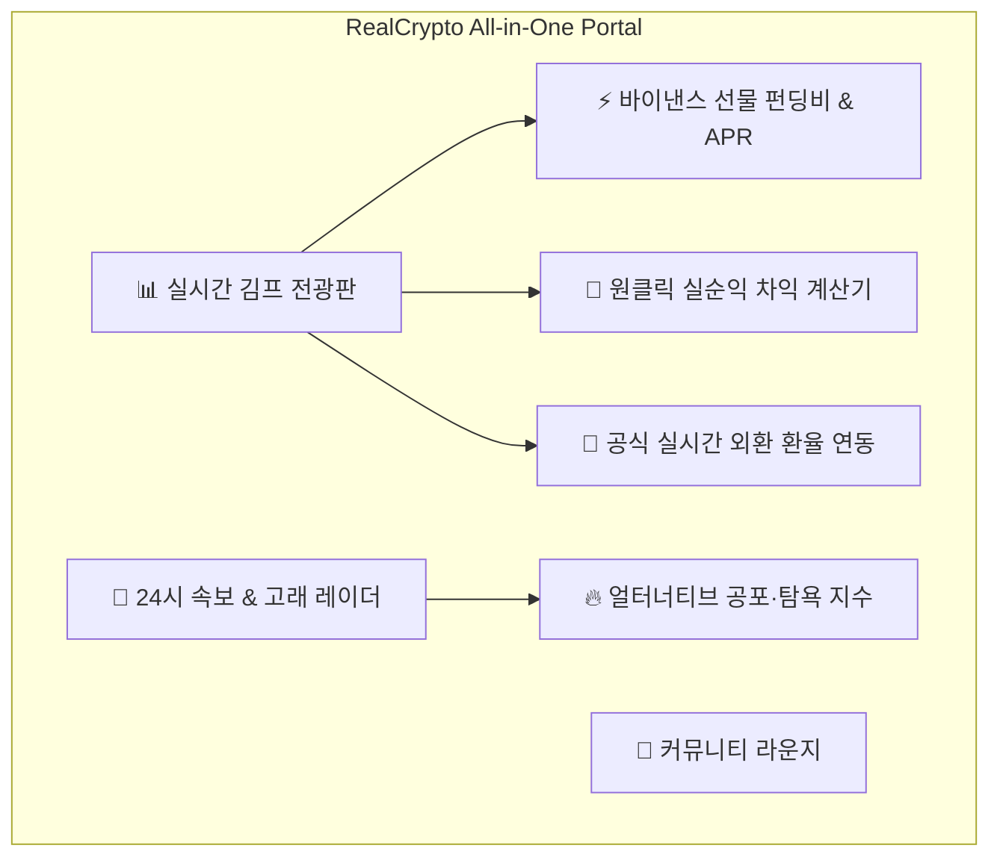

# 🚀 RealCrypto (리얼크립토) - 대한민국 1등 암호화폐 올인원 포털

> **업비트 · 빗썸 · 바이낸스 3대 거래소 실시간 김치 프리미엄**, **바이낸스 선물 8시간 펀딩비(APR)**, **공식 실시간 외환 환율**, **코인니스 스타일 24시 실시간 속보 & 온체인 고래 레이더**, **코인판 스타일 4대 커뮤니티 & 개미 심리 배틀**을 한곳에 집약한 차세대 크립토 포털입니다.

---

## 🌟 3대 경쟁 플랫폼 벤치마킹 & 핵심 기능



### 1. 📊 【김프가(kimpga) 벤치마크】 실시간 김프 & 차익거래 엔진
- **3대 거래소(업비트 · 빗썸 · 바이낸스) 480+ 전 종목 실시간 교차 분석**: 10초 주기 일괄 수집 및 Redis 캐싱
- **바이낸스 선물 8시간 펀딩비 & 연환산(APR) 열 토글**: 롱/숏 포지션 쏠림 및 과열 상태 모니터링
- **공식 실시간 외환 환율(USD/KRW) 자동 연동**: 글로벌 오픈 외환 API를 통한 정밀한 김프 계산
- **원클릭 차익거래 실순익 계산기**: 매매 수수료(0.19%) + 출금 네트워크 수수료를 차감한 **진짜 내 손의 실수령 순이익 랭킹** 산출

### 2. 📰 【코인니스(coiness) 벤치마크】 24시 속보 & 온체인 고래 레이더
- **24시 실시간 크립토 1줄 속보 피드**: Google News Crypto RSS 실시간 XML 스크래핑 및 `#BTC`, `#ETH`, `#XRP` 코인 심볼 자동 태깅 & 호재/악재 감성 분석
- **얼터너티브 공포·탐욕 지수 (Fear & Greed Index)**: 현재 시장 심리 단계 및 7일 추이 게이지 제공
- **100억원+ 온체인 고래 대량 이동 레이더 (Whale Alert)**: Blockchain.info 온체인 트랜잭션 풀을 실시간 추적하여 거래소 유입/유출 및 업비트 시세 기준 원화 환산액 표기

### 3. 💬 【코인판(coinpan) 벤치마크】 투자자 커뮤니티 & 심리 배틀
- **자체 JWT 회원가입 / 로그인 시스템**: 안전한 사용자 인증 및 닉네임 기반 활동
- **4대 특화 카테고리**: `자유게시판`, `익절/손절 인증소`, `김프/차익 꿀팁`, `코인 분석`
- **`🟢 롱 / 🔴 숏 / ⚪ 중립` 포지션 뱃지 & 실시간 개미 심리 투표 바**
- **추천/비추천 토글 및 🔥 BEST(념글) 자동 선정 시스템**

---

## 🏛 시스템 아키텍처 (Hexagonal Architecture)

도메인 비즈니스 로직을 외부 인프라(거래소 API, Redis, MySQL, Web)와 완전히 격리하는 **포트 & 어댑터(Hexagonal Architecture)** 패턴을 적용했습니다.

```
realcrypto/
├── src/main/java/com/realcrypto/
│   ├── domain/               # 핵심 비즈니스 도메인 모델 (CryptoPrice, User, Post, Comment)
│   ├── application/          # 비즈니스 서비스 & 유스케이스
│   │   ├── port/in/          # 인바운드 포트
│   │   ├── port/out/         # 아웃바운드 포트 (ExchangeClientPort, ArbitrageCachePort 등)
│   │   └── service/          # PriceCollectService, CryptoInsightService, AuthService, PostService
│   ├── adapter/
│   │   ├── in/web/           # REST 컨트롤러 (CryptoPriceController, PostController, AuthController)
│   │   └── out/
│   │       ├── exchange/     # Upbit, Bithumb, Binance, BinanceFutures, RealNews, RealWhale, FearGreed
│   │       ├── cache/        # Redis 캐시 어댑터 (ArbitrageRedisAdapter)
│   │       └── persistence/  # JPA 리포지토리 어댑터
│   └── global/               # Security, JWT, Redis, Config
└── frontend/                 # Next.js 16 (App Router), React 19, Tailwind CSS, Lucide
```

---

## 🛠 기술 스택 (Tech Stack)

### Backend
- **Java 17 / Spring Boot 3.4.1**
- **Spring Data JPA / QueryDSL / MySQL 8.0**
- **Spring Data Redis** (실시간 시세 초고속 인메모리 캐싱)
- **Spring Security & JJWT** (무상태 자체 인증 토큰)
- **HttpClient / RestTemplate** (실시간 거래소 & RSS 비동기 수집)

### Frontend
- **Next.js 16 (App Router) / React 19 / TypeScript**
- **Tailwind CSS** (클린 화이트 미니멀 테마)
- **Lucide React** (모던 아이콘 팩)

---

## 🚀 빠른 시작 가이드 (Getting Started)

### 1. 사전 요구사항
- JDK 17+
- Node.js 18+ & npm
- MySQL 8.0 & Redis

### 2. 백엔드 실행
```bash
# 1. DB 설정 확인 (src/main/resources/application.properties)
# 2. 백엔드 서버 기동
./gradlew.bat bootRun
```
> 백엔드 서버는 `http://localhost:8080`에서 실행됩니다.

### 3. 프론트엔드 실행
```bash
cd frontend
npm install
npm run dev
```
> 웹 브라우저에서 `http://localhost:3000`에 접속합니다.

---

## 📅 개발 일지 및 트러블슈팅 기록

### 2026-07-13 ~ 07-14: 초기 시세 수집 및 JPA 최적화
- **타임리프 SSR 대시보드 구현**: 첫 페이지 진입 시 속도 최적화를 위해 SSR + CSR 하이브리드 구조 설계
- **QueryDSL N+1 방지**: 시세 테이블과 대상 코인 테이블 간의 조인 쿼리 최적화

### 2026-08-03 ~ 08-07: 3사 일괄 수집 & Redis 분산 캐싱 & 펀딩비 연동
- **수백 개 코인 API 호출 제한(Rate Limit) 해결**: 5초마다 개별 코인을 요청하지 않고, 거래소별 1회 일괄 티커 API(`/v1/ticker`, `/ticker/ALL_KRW`, `/ticker/24hr`)를 통해 수백 개 코인을 1회 메모리 조인으로 해결
- **디스크 I/O 병목 제거**: 수초 단위 실시간 시세는 MySQL 쓰기 대신 Redis 인메모리 캐시(`ArbitrageCachePort`)에 TTL 30초로 캐싱하여 DB 부하 0% 달성
- **바이낸스 선물 8시간 펀딩비율 및 연이율(APR) 계산기** 연동

### 2026-08-09 ~ 08-13: 보안 인증, 4대 커뮤니티 & 실시간 뉴스/고래 온체인 레이더
- **JWT 무상태 인증 구축**: 자체 회원가입, 닉네임 중복 검증, 토큰 기반 인가
- **4대 커뮤니티 백엔드**: 익절/손절 수익률 뱃지, 롱/숏 포지션 뷰, 추천수 5개 이상 시 자동 BEST 념글 승격
- **라이브 데이터 스크래퍼**: Google News Crypto RSS 및 Blockchain.info 온체인 트랜잭션 풀을 1분 주기로 실시간 파싱 및 감성 분석

### 2026-08-15 ~ 08-16: Next.js 16 프로덕션 포털 UI 완성 & 이상치 필터링
- **프론트엔드 풀스택 포털화**: 실시간 김프 전광판, 24시 속보/고래 레이더, 코인판 커뮤니티 라운지 구현
- **공식 실시간 외환 환율(1,414.86원) 연동**: 하드코딩 환율 대신 글로벌 오픈 외환 API를 통한 실시간 매매기준율 연동
- **평균 김프 이상치(Outlier) 보정**: 동음이의어 티커(DATA, PROS 등)로 인한 평균 왜곡을 절사평균(Trimmed Mean, ±20% 범위 필터) 알고리즘으로 제거하여 정상 시장 체감 김프(`-0.15%`) 산출

---

## 📄 라이선스
MIT License © 2026 RealCrypto Team.
Aggregated with Upbit, Bithumb & Binance Public APIs.
